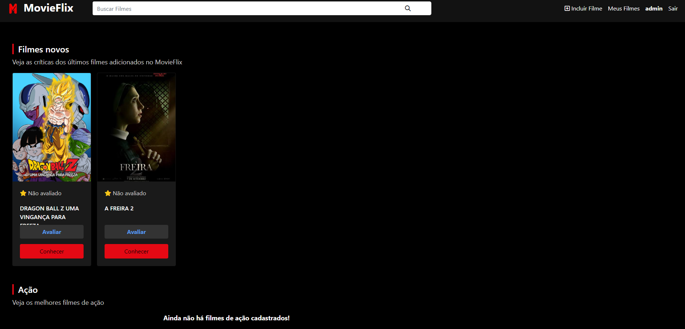

# MovieFlix

## 💻 Pré-requisitos

Antes de começar, verifique se você atendeu aos seguintes requisitos:

- Você instalou a versão mais recente de `PHP / MYSQL / XAMPP`
- Você tem uma máquina `<Windows / Linux / Mac>`.
- Verifique seu arquivo `php.ini` é ative o comando `extension=gd`.

## 🚀 Instalando MovieFlix

Para instalar o MovieFlix, siga estas etapas:

Ative o `Apache` é `MYSQL` no `XAMPP`

## 📫 Contribuindo para MovieFlix

Para contribuir com MovieFlix, siga estas etapas:

1. Bifurque este repositório.
2. Crie um branch: `git checkout -b <nome_branch>`.
3. Faça suas alterações e confirme-as: `git commit -m '<mensagem_commit>'`
4. Envie para o branch original: `git push origin MovieFlix / <local>`
5. Crie a solicitação de pull.

Como alternativa, consulte a documentação do GitHub em [como criar uma solicitação pull](https://help.github.com/en/github/collaborating-with-issues-and-pull-requests/creating-a-pull-request).

## 🤝 Desenvolvedor

Projeto desenvolvidor para cadeira da faculdade Desenvolvimento Web

<table>
  <tr>
    <td align="center">
      <a href="#" title="Hebert">
         
        
          <b>HebertFSoares</b>
        
      </a>
    </td>
  </tr>
</table>

## 😄 Seja um dos contribuidores

Quer fazer parte desse projeto? Clique [AQUI](CONTRIBUTING.md) e leia como contribuir.

## 📝 Licença

Esse projeto está sob licença. Veja o arquivo [LICENÇA](LICENSE.md) para mais detalhes.
